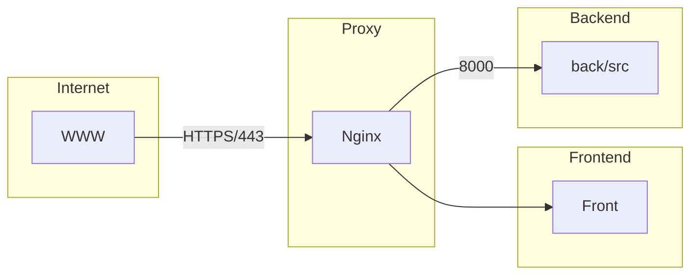

# Transcendence Project

## Overview
ft_transcendence is a real-time multiplayer Pong tournament web application built as part of a 42 school project.
It features a responsive single-page interface developed in **TypeScript** and allows users to play live
Pong games locally or remotely. Players can register with aliases, participate in matchmaking, and compete
in tournaments with clearly displayed match order. The game is fully containerized using Docker and follows
strict frontend, backend, and security guidelines.Passwords are securely hashed, inputs are validated, and
all communication is secured via HTTPS/WSS. The project avoids full-feature third-party libraries and ensures
compatibility with the latest stable version of Firefox. The architecture follows this flow:



### **Architecture Components**
- **Internet**: External access to the application.
- **Proxy (Nginx)**: Acts as a reverse proxy, forwarding requests to the frontend and backend.
- **Frontend**: A TypeScript-based UI served by Nginx.
- **Backend**: A Node.js-based server handling application logic and database communication.

## **Feature Checklist**
### **Major Modules** (1 point each)
✅ Use a framework to build the backend. (Node.js)  
✅ Standard user management, authentication, users across tournaments.  
✅ Remote players (1 point) (?)  
✅ Implement Two-Factor Authentication (2FA) and JWT. (?)  

### **Minor Modules** (0.5 points each)
✅ Use a framework or a toolkit to build the frontend. (Tailwind CSS)  
✅ Use a database for the backend.  
✅ Game customization options.  
✅ User and game stats dashboards.  
✅ Monitoring system.  
✅ Supports multiple languages.  

## **Technologies Used**
- **Frontend**: TypeScript, Tailwind CSS
- **Backend**: Node.js
- **Database**: SQLite
- **Proxy**: Nginx
- **Authentication**: JWT, Two-Factor Authentication (2FA)
- **Monitoring**: Prometheus, Grafana

## **Setup Instructions**
1. Clone the repository:
   ```sh
   git clone https://github.com/your-repo/transcendence.git
   cd transcendence
   ```
2. Start the application using Docker Compose:
   ```sh
   docker compose up --build
   ```
3. The application will be available at `https://${SERVER_IP}:8443/`

---

This README provides an overview of the project architecture and feature list. More details will be added as the project evolves.

